# 🧠 AI Study Assistant

> An AI-powered learning platform that transforms study documents into structured, interactive learning experiences.

**AI Study Assistant** is a full-stack educational platform designed to help students learn from their own study materials.

Instead of simply sending an uploaded document to an AI model and asking it to summarize the content, the system uses a multi-stage processing pipeline to extract, structure, analyze, and reason about learning content before generating study materials.

Students can upload learning materials, generate summaries, concepts, flashcards, quizzes, and explanations, and interact with their study content through the web application and Telegram.

The project also includes background workers, asynchronous job processing, Redis queues, document ingestion, AI usage observability, administrative controls, security protections, and an evidence-grounded intelligence engine.

---

## 🌐 Live Application

**Web Application:** https://ai-study-ass.vercel.app

**Telegram Bot:** [@aistudyassbot](https://t.me/aistudyassbot)

**GitHub Repository:** https://github.com/ANG-KUNG-TANG/ai-study-ass

---

## 📖 Table of Contents

- [Overview](#-overview)
- [Problem](#-problem)
- [Solution](#-solution)
- [Core Features](#-core-features)
- [Application Preview](#-application-preview)
- [How It Works](#-how-it-works)
- [System Architecture](#-system-architecture)
- [Document Processing Pipeline](#-document-processing-pipeline)
- [AI Study Generation](#-ai-study-generation)
- [Intelligence Engine](#-intelligence-engine)
- [Knowledge Gap Detection](#-knowledge-gap-detection)
- [Background Workers](#-background-workers)
- [Queue Architecture](#-queue-architecture)
- [Telegram Integration](#-telegram-integration)
- [Admin Observability](#-admin-observability)
- [Security](#-security)
- [Technology Stack](#-technology-stack)
- [Project Structure](#-project-structure)
- [Local Development](#-local-development)
- [Docker Development](#-docker-development)
- [Environment Variables](#-environment-variables)
- [Testing](#-testing)
- [Production Deployment](#-production-deployment)
- [Architecture Decisions](#-architecture-decisions)
- [Engineering Challenges](#-engineering-challenges)
- [Future Improvements](#-future-improvements)
- [Project Status](#-project-status)
- [Author](#-author)
- [License](#-license)

---

## 🎯 Overview

AI Study Assistant is designed around a simple idea:

> **Students should be able to learn from their own materials without manually converting those materials into study resources.**

A student can upload a learning document and let the system process it into structured study content.

The platform supports a workflow such as:

```text
Upload Study Material
        ↓
Document Processing
        ↓
Text Extraction
        ↓
Content Structuring
        ↓
Concept Analysis
        ↓
Study Material Generation
        ↓
Review & Learning
```

---

## ❓ Problem

Students often receive learning materials in formats such as:

- PDF lecture notes
- Course materials
- Technical documentation
- Text documents
- Presentation materials

Although these materials contain the required information, they are not always structured for effective learning.

Students may need to manually:

1. Read through large amounts of content.
2. Identify the important concepts.
3. Write their own summaries.
4. Create flashcards.
5. Create practice questions.
6. Identify concepts they do not understand.
7. Review the material repeatedly.

This process can be time-consuming, especially when students are working with large technical documents.

Traditional document viewers also provide limited support for transforming static learning materials into interactive study experiences.

AI Study Assistant addresses this problem by turning learning materials into structured study resources that students can actively use for learning and revision.

---

## 💡 Solution

AI Study Assistant transforms static learning materials into interactive learning resources through a multi-stage processing pipeline.

Instead of treating an uploaded document as a single prompt, the system separates document processing, content analysis, AI generation, and learning support into different stages.

```text
                         Study Material
                               │
                               ▼
                         Document Upload
                               │
                               ▼
                       Document Processing
                               │
                               ▼
                         Text Extraction
                               │
                               ▼
                       Content Structuring
                               │
                 ┌─────────────┴─────────────┐
                 │                           │
                 ▼                           ▼
          Study Generation            Intelligence Engine
                 │                           │
        ┌────────┼────────┐          ┌───────┼────────┐
        │        │        │          │       │        │
        ▼        ▼        ▼          ▼       ▼        ▼
     Summary    Quiz  Flashcards  Concepts  Graph  Reasoning
        │        │        │          │       │        │
        └────────┴────────┘          └───────┴────────┘
                 │                           │
                 └─────────────┬─────────────┘
                               ▼
                       Learning Experience
                               │
                    ┌──────────┴──────────┐
                    │                     │
                    ▼                     ▼
               Web Application        Telegram
```

---

## ✨ Core Features

### 📄 Document Upload

Students can upload their learning materials and use them as the source for generating study resources.

The document processing pipeline handles the uploaded material asynchronously so that long-running processing does not block the main web application.

### 📝 AI-Generated Study Materials

The platform can transform processed learning materials into several types of study resources.

- **📚 Summaries:** Generate structured summaries that condense important information from the source material.
- **🧩 Key Concepts:** Identify important concepts and ideas found within the learning material.
- **🃏 Flashcards:** Convert important concepts into question-and-answer flashcards for revision.
- **📝 Quizzes:** Generate practice questions based on the processed learning content.
- **💡 Explanations:** Provide explanations for concepts and learning questions using the available source material.

### 🧠 Knowledge-Based Learning

The system goes beyond simple text generation by representing concepts and their relationships.

Concepts can be organized into structures such as:

```text
Computer Networks
│
├── IP Address
│   └── Subnet
│
├── Router
│   └── Routing
│
├── Switch
│
└── Transport Layer
    ├── TCP
    └── UDP
```

---

## 📸 Application Preview

> The images below load from `docs/screenshots/`. Make sure these files are committed to the repository and that the file names match exactly (GitHub paths are case-sensitive).

### 🏠 Student Dashboard

<p align="center">
  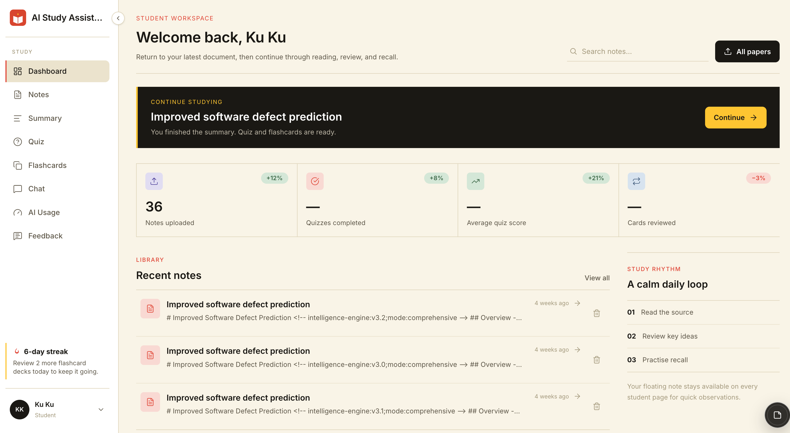
</p>

The dashboard provides the main learning workspace where students can access their uploaded materials, generated study resources, learning progress, and other learning features.

---

### 📄 Upload Screen

<p align="center">
  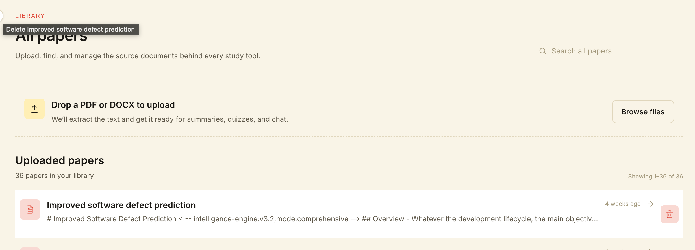
</p>

Students can upload their learning materials and start the document-processing pipeline.

---

### 📚 Study Materials

#### Summary

<p align="center">
  
</p>

The system transforms processed learning content into a structured summary for review.

#### Summary Notes

<p align="center">
  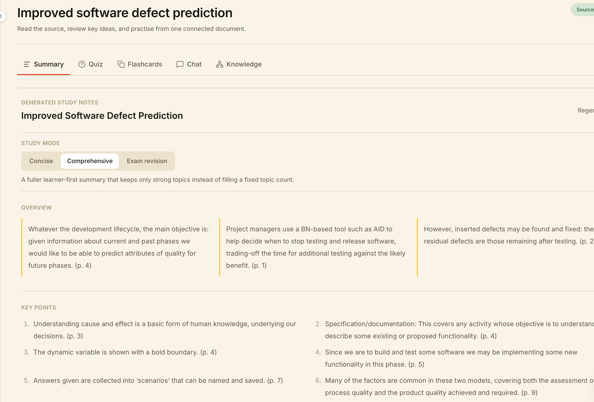
</p>

Students can work with the generated notes as part of their study workflow.

#### Concepts

<p align="center">
  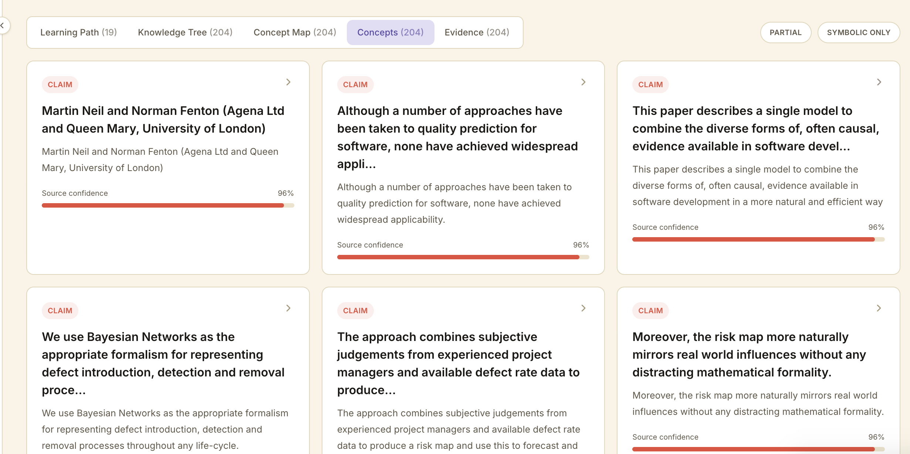
</p>

Important concepts extracted from the learning material are presented as structured learning content.

#### Flashcards

<p align="center">
  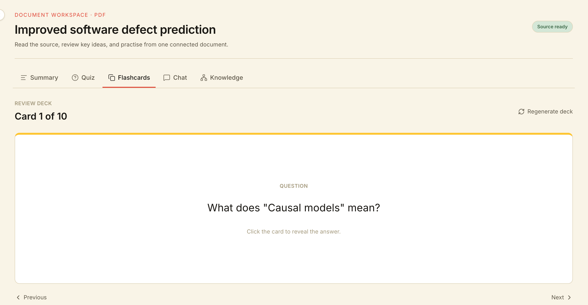
</p>

Students can review important concepts using generated flashcards.

#### Quiz

<p align="center">
  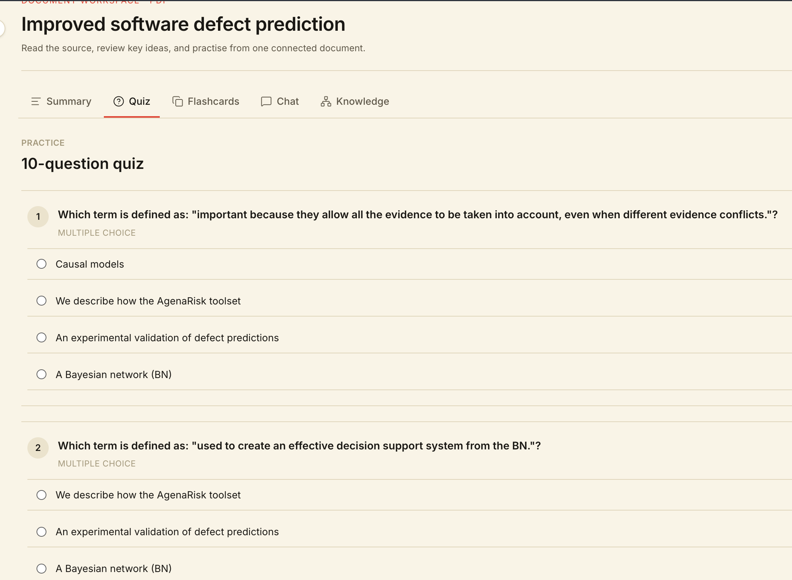
</p>

The platform generates practice questions from the learning material.

---

### 🧠 Intelligence Views

#### Concept Map

<p align="center">
  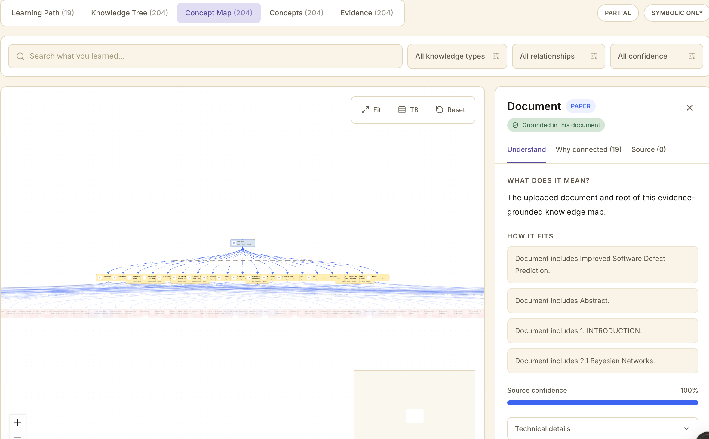
</p>

Concept relationships can be visualized as a knowledge map.

#### Knowledge Tree

<p align="center">
  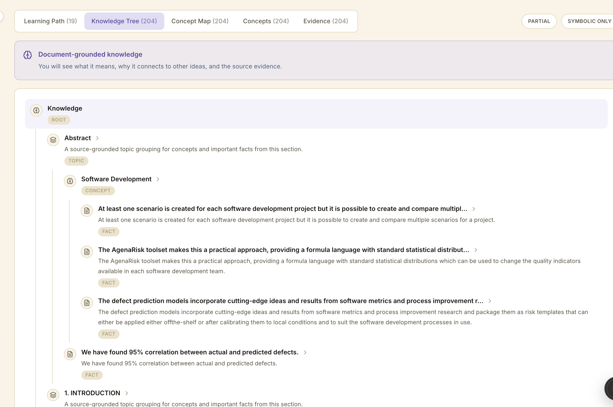
</p>

The knowledge tree provides another representation of the relationships between learning concepts.

#### Learning Path

<p align="center">
  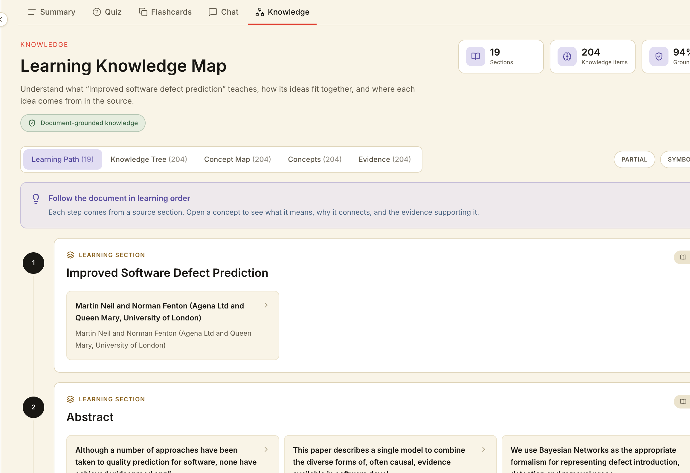
</p>

The learning path organizes concepts into a structured progression.

#### Evidence

<p align="center">
  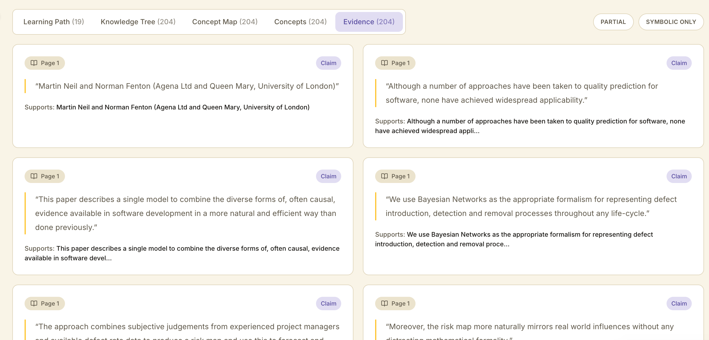
</p>

Evidence-based learning information helps connect generated explanations with the underlying learning material.

---

### 💬 Learning Interaction

#### AI Chat

<p align="center">
  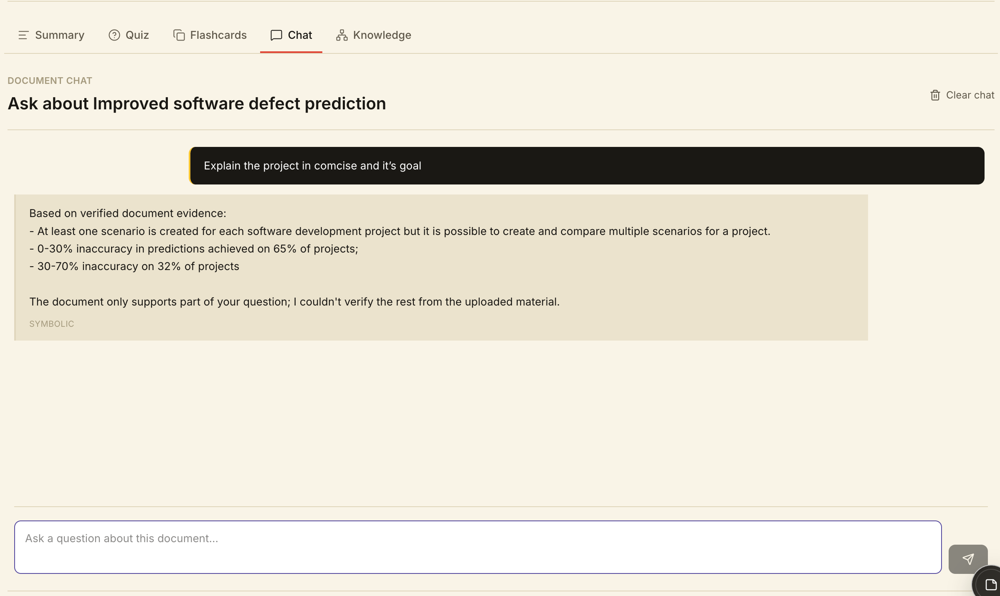
</p>

Students can interact with their learning material through the AI-assisted chat interface.

#### Feedback

<p align="center">
  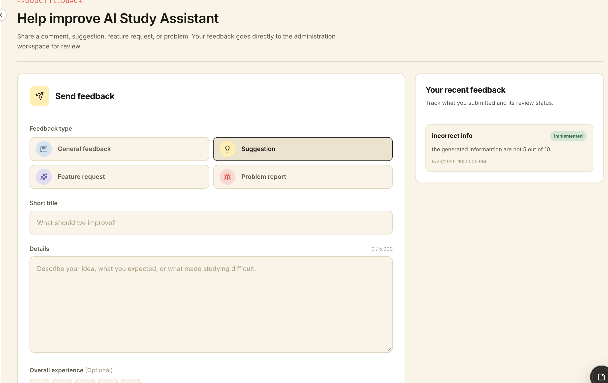
</p>

Students can provide feedback about their learning experience.

---

### 📊 AI Usage Dashboard

<p align="center">
  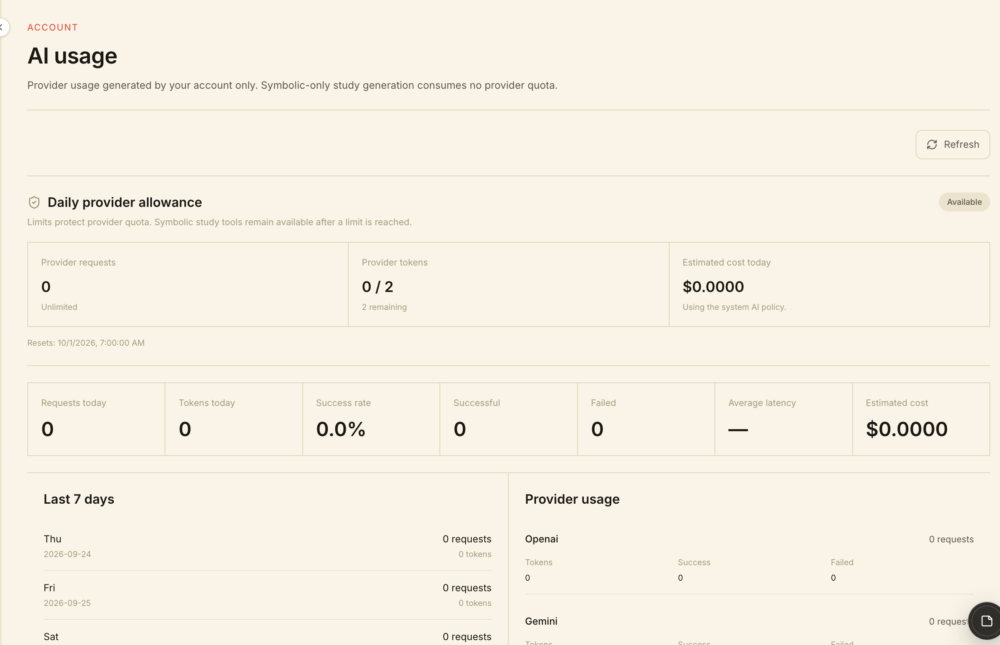
</p>

The platform provides visibility into AI usage and learning-related activity.

---

## 🔄 How It Works

The complete learning workflow can be summarized as:

```text
                     Student
                        │
                        ▼
                 Upload Document
                        │
                        ▼
                 Next.js Application
                        │
                        ▼
                 Document Ingestion
                        │
                        ▼
                   PDF Worker
                        │
                        ▼
                 Text Extraction
                        │
                        ▼
                Processed Content
                        │
                        ▼
             Study Generation Queue
                        │
                        ▼
                AI Generation Worker
                        │
              ┌─────────┴─────────┐
              │                   │
              ▼                   ▼
        Study Materials    Intelligence Engine
              │                   │
              │            ┌──────┴──────┐
              │            │             │
              │         Concepts      Reasoning
              │            │             │
              │            └──────┬──────┘
              │                   │
              └─────────┬─────────┘
                        ▼
                Student Learning
                        │
                 ┌──────┴──────┐
                 ▼             ▼
                Web         Telegram
```

---

## 🧱 System Architecture

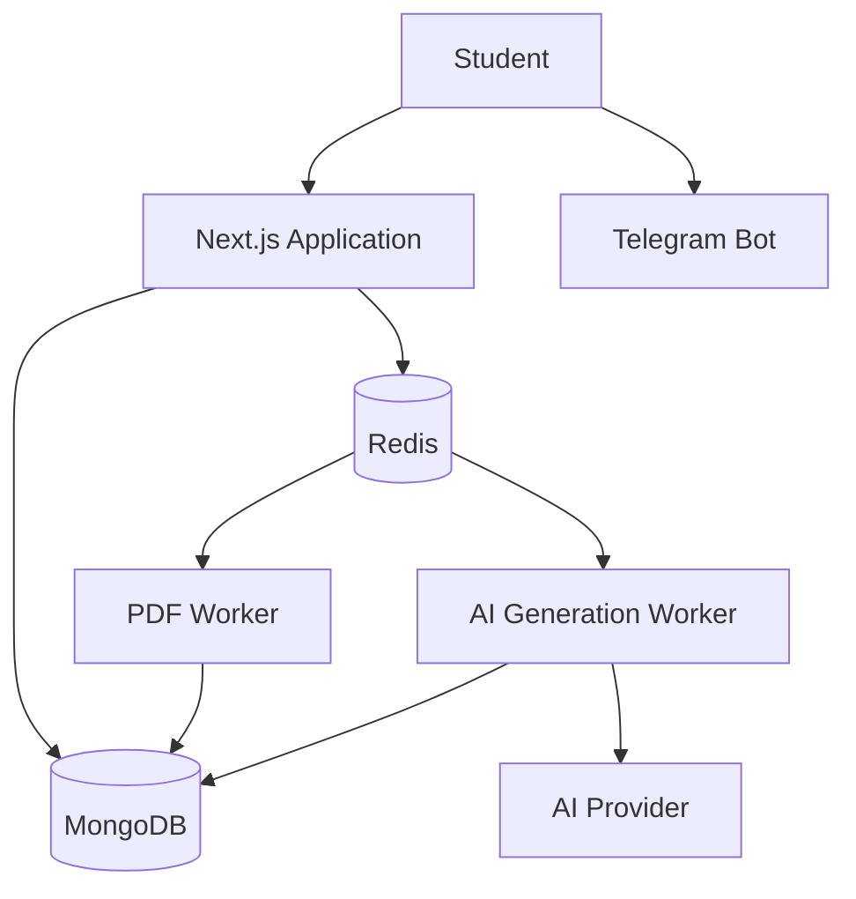

---

## 📄 Document Processing Pipeline

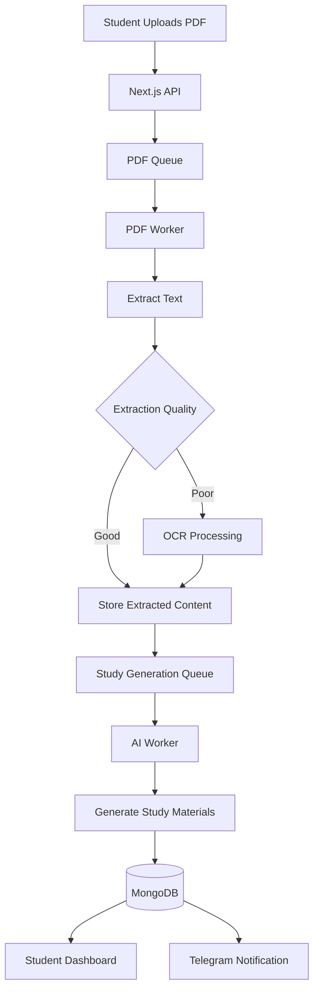

---

## 📝 AI Study Generation

Study-generation jobs are processed asynchronously rather than keeping a browser request open for the entire generation process.

```text
Study Generation Job
        │
        ▼
Load Processed Content
        │
        ▼
Prepare AI Context
        │
        ▼
Generate Learning Resources
        │
   ┌────┼────────┬─────────┐
   ▼    ▼        ▼         ▼
Summary Quiz Flashcards Concepts
        │
        ▼
   Store Results
        │
        ▼
 Notify / Display
```

---

## 🧠 Intelligence Engine

The intelligence engine provides a structured layer around the learning content.

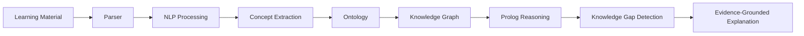

The goal is to combine natural-language generation with structured knowledge and explicit reasoning.

---

## 🔍 Knowledge Gap Detection

Knowledge gap detection is the stage of the intelligence engine that helps identify which concepts a student may not yet understand.

By combining the concept graph, symbolic reasoning, and the student's learning activity (such as quiz and flashcard results), the system can highlight weak or missing concepts and support a more focused review.

Related concepts are planned as part of [Future Improvements](#-future-improvements), including concept mastery tracking and weak-concept detection.

---

## ⚡ Background Workers

Long-running workloads are separated from the web process.

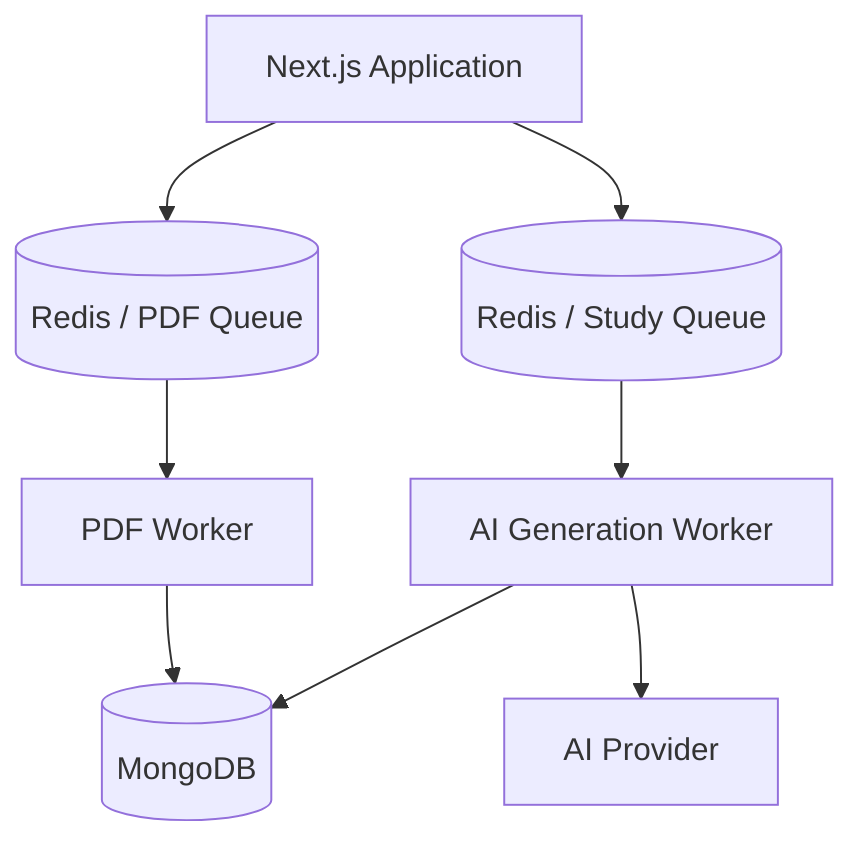

### PDF Worker

Responsible for document ingestion and text extraction.

### AI Generation Worker

Responsible for asynchronous generation of study resources and related processing.

---

## 🔄 Queue Architecture

Redis and BullMQ provide the asynchronous job-processing layer.

```text
                    Redis
                      │
            ┌─────────┴─────────┐
            │                   │
            ▼                   ▼
     PDF Ingestion Queue   Study Generation Queue
            │                   │
            ▼                   ▼
       PDF Worker          AI Worker
            │                   │
            └─────────┬─────────┘
                      ▼
                   MongoDB
```

Benefits include:

- Non-blocking web requests
- Background processing
- Retryable jobs
- Failure isolation
- Worker monitoring
- Independent scaling of workloads

---

## 📱 Telegram Integration

The Telegram workflow is:

```text
Telegram User
      │
      ▼
Telegram Bot
      │
      ▼
Webhook
      │
      ▼
Next.js API
      │
      ▼
Application Services
      │
      ▼
Study System
      │
      ▼
Telegram Response / Notification
```

---

## 📊 Admin Observability

The project includes administrative observability for operational and AI-related monitoring.

Areas include:

- AI usage
- Per-student usage
- Provider/model usage
- Request latency
- Token usage
- Failed requests
- Quota events
- Worker health
- Redis health
- MongoDB health
- Telegram health
- Application uptime
- Memory usage
- Audit activity
- Security events
- Processing jobs

---

## 🔐 Security

Security is considered at the application, infrastructure, and container layers.

### Application Security

- Authentication
- Authorization
- Input validation
- Rate limiting
- Audit logging
- Secure session handling
- Environment-based secrets

### HTTP Security

The application uses security headers such as:

```text
Content-Security-Policy
X-Content-Type-Options
X-Frame-Options
Referrer-Policy
Permissions-Policy
Strict-Transport-Security
```

### Container Security

Worker and application containers can be hardened through:

```text
Non-root execution
No-new-privileges
Dropped Linux capabilities
Read-only filesystem
Resource limits
Temporary filesystem
Health checks
```

---

## 🔧 Technology Stack

| Category | Technologies |
|---|---|
| Frontend | Next.js, React, TypeScript, Tailwind CSS |
| Backend | Next.js API Routes, Node.js |
| Database | MongoDB, Mongoose |
| Queue | Redis, BullMQ, IORedis |
| AI | Google GenAI |
| Document Processing | PDF Parse, Mammoth, Tesseract OCR |
| Reasoning | Tau-Prolog |
| Visualization | XYFlow (@xyflow/react) |
| Authentication | JWT (jsonwebtoken, jose), Google OAuth |
| Validation | Zod |
| Email | Resend |
| Infrastructure | Docker, Docker Compose |
| Deployment | Vercel |
| Messaging | Telegram Bot API |

---

## 📁 Project Structure

```text
ai-study-assistant/
│
├── app/
│   ├── api/
│   ├── admin/
│   ├── student/
│   └── ...
│
├── src/
│   └── server/
│       ├── config/
│       ├── intelligence/
│       │   └── prolog/
│       ├── queues/
│       ├── repositories/
│       ├── services/
│       ├── utils/
│       └── workers/
│           ├── study-generation.worker.ts
│           └── pdf-ingestion.worker.ts
│
├── docs/
│   └── screenshots/
│
├── public/
├── Dockerfile
├── compose.yaml
├── compose.prod.yaml
├── next.config.ts
├── package.json
├── tsconfig.json
└── README.md
```

---

## 💻 Local Development

### Requirements

- Node.js 20.9 or later (required by Next.js 16)
- npm (bundled with Node.js)
- Docker
- Docker Compose

### Clone the repository

```bash
git clone https://github.com/ANG-KUNG-TANG/ai-study-ass.git
cd ai-study-ass
```

### Install dependencies

```bash
npm install
```

### Configure environment variables

Create the appropriate local environment file and provide the required database, Redis, authentication, AI, storage, and Telegram configuration.

See [Environment Variables](#-environment-variables).

### Start the development server

```bash
npm run dev
```

Open:

```text
http://localhost:3000
```

### Start the background workers

The web app only enqueues jobs. To process them, start the workers in separate terminals (Redis and MongoDB must be running, for example via Docker Compose):

```bash
npm run worker       # AI study-generation worker
npm run worker:pdf   # PDF ingestion worker
```

### Available scripts

| Command | Description |
|---|---|
| `npm run dev` | Start the Next.js development server |
| `npm run build` | Create a production build |
| `npm start` | Run the production build |
| `npm run lint` | Run ESLint |
| `npm run typecheck` | Run TypeScript type checking (`tsc --noEmit`) |
| `npm test` | Run the Jest test suite |
| `npm run test:watch` | Run Jest in watch mode |
| `npm run test:coverage` | Generate a coverage report |
| `npm run format` | Format the codebase with Prettier |
| `npm run format:check` | Check formatting without changing files |
| `npm run check` | Run typecheck, lint, tests, and build in sequence |
| `npm run worker` | Start the AI study-generation worker |
| `npm run worker:pdf` | Start the PDF ingestion worker |
| `npm run docker:build` | Build the Docker image |
| `npm run docker:up` | Start the Docker Compose stack |
| `npm run docker:down` | Stop the Docker Compose stack |
| `npm run docker:logs` | Follow the app container logs |
| `npm run docker:prod` | Start the production Compose stack |

---

## 🐳 Docker Development

Start the local service stack:

```bash
docker compose up --build -d
# or
npm run docker:up
```

Check running services:

```bash
docker compose ps
```

View logs:

```bash
docker compose logs -f
```

Stop the environment:

```bash
docker compose down
```

Typical services include:

```text
ai-study-app
ai-study-worker
ai-study-pdf-worker
ai-study-redis
ai-study-mongo
```

---

## 🔑 Environment Variables

Create your local environment configuration from your own deployment requirements.

Typical variables include:

```env
# Application
APP_URL=
APP_PUBLIC_URL=

# Database
MONGODB_URI=

# Redis
REDIS_URL=

# Authentication
JWT_ACCESS_SECRET=
JWT_REFRESH_SECRET=

# Google OAuth
GOOGLE_CLIENT_ID=
GOOGLE_CLIENT_SECRET=

# AI
GOOGLE_AI_API_KEY=

# Telegram
TELEGRAM_BOT_TOKEN=
TELEGRAM_WEBHOOK_SECRET=

# Email
RESEND_API_KEY=
```

> **Never commit real secrets, API keys, passwords, tokens, or private connection strings to GitHub.**

A recommended repository file is `.env.example`, containing variable names but no secret values.

---

## 🧪 Testing

Run the test suite:

```bash
npm test
```

Run tests in watch mode:

```bash
npm run test:watch
```

Generate coverage:

```bash
npm run test:coverage
```

Run type checking:

```bash
npm run typecheck
```

Run linting:

```bash
npm run lint
```

Run the full pre-merge check (typecheck, lint, tests, build):

```bash
npm run check
```

---

## 🚀 Production Deployment

The web application can be deployed independently from the background workers.

Conceptually:

```text
                         Internet
                            │
                            ▼
                    ┌──────────────┐
                    │  Next.js Web │
                    │   Hosting    │
                    └──────┬───────┘
                           │
             ┌─────────────┼─────────────┐
             │             │             │
             ▼             ▼             ▼
          MongoDB        Redis       AI Provider
                            │
                   ┌────────┴────────┐
                   │                 │
                   ▼                 ▼
               AI Worker         PDF Worker
```

This separation allows web traffic and background workloads to be managed independently.

---

## 🧩 Architecture Decisions

### Why background workers?

Document processing and AI generation can take significantly longer than normal API operations.

Moving those tasks into queues and workers allows the API to respond quickly while processing continues asynchronously.

### Why Redis + BullMQ?

Redis provides fast queue infrastructure, while BullMQ provides job management features such as retries, worker processing, and job states.

### Why MongoDB?

The application works with flexible learning content, generated resources, usage telemetry, and other document-oriented data. MongoDB provides a natural fit for these structures.

### Why a hybrid AI + symbolic architecture?

AI models are useful for natural-language generation, summarization, and explanations. Structured knowledge and symbolic reasoning provide explicit relationships and deterministic rule-based inference.

The project therefore combines:

```text
AI Generation
      +
Structured Knowledge
      +
Knowledge Graph
      +
Ontology
      +
Symbolic Reasoning
```

---

## 🛠 Engineering Challenges

### Long-running operations

AI generation and document processing cannot always be treated as ordinary request-response operations.

**Approach:** asynchronous queues and dedicated workers.

### PDF processing

Documents can contain different layouts, encodings, and scanned pages.

**Approach:** extraction quality checks and OCR support.

### Worker failures

Background jobs can fail independently of the web application.

**Approach:** queue-based job states, retries, and worker health monitoring.

### AI observability

AI applications require different operational metrics from traditional CRUD systems.

**Approach:** track provider, model, feature, latency, token usage, failures, and usage limits.

### Secure processing

Uploaded documents should not automatically receive unrestricted access to the host environment.

**Approach:** isolated containers, non-root execution, dropped capabilities, resource limits, and restricted filesystems.

---

## 🔮 Future Improvements

Potential future improvements include:

### Personalized Learning

- Adaptive quiz difficulty
- Personalized recommendations
- Concept review priorities
- Learning progress analysis

### Spaced Repetition

Introduce scheduling for flashcard and concept review.

### Multi-Document Knowledge Bases

Allow multiple documents to contribute to a single course-level knowledge base.

### Advanced Knowledge Graphs

Improve:

- Concept extraction
- Relationship detection
- Prerequisite detection
- Knowledge graph visualization

### Learning Analytics

Add:

- Concept mastery
- Quiz performance
- Review frequency
- Weak concept detection
- Learning progress
- Study-time trends

---

## 📌 Project Status

AI Study Assistant is an active academic and portfolio project focused on combining:

**Full-stack development + AI engineering + asynchronous systems + document processing + knowledge representation + DevOps + security.**

Current areas include:

- ✅ Next.js web application
- ✅ TypeScript
- ✅ MongoDB
- ✅ Redis
- ✅ BullMQ
- ✅ Background workers
- ✅ PDF ingestion
- ✅ AI study generation
- ✅ Telegram integration
- ✅ AI usage observability
- ✅ Worker health monitoring
- ✅ Administrative controls
- ✅ Audit logging
- ✅ Docker development environment
- ✅ Security controls
- ✅ Knowledge representation
- ✅ Symbolic reasoning
- 🚧 Further intelligence-engine improvements
- 🚧 More advanced learning personalization

---

## 👤 Author

**Ang Kung Tang**

Computer Science / Digital Technology Innovation Student

**GitHub:** https://github.com/ANG-KUNG-TANG

**Project:** https://github.com/ANG-KUNG-TANG/ai-study-ass

---

## 📄 License

This project is currently developed as a personal academic and portfolio project.